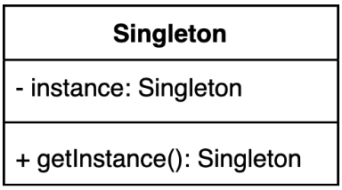

# Singleton Pattern

오직 하나의 인스턴스만 제공하는 클래스



시스템 런타임, 환경 세팅에 대한 정보 등, 인스턴스가 여러개 일 때 문제가 생길 수 있는 경우가 있다. 인스턴스를 오직 한개만 만들어 제공하는 클래스가 필요하다.

## 간단한 구현 예시

````java
public class Settings {
	private static Settings instance;

	private Settings() {
	}

	public static Settings getInstance() {
		// non thread safe
		if (instance == null) {
			instance = new Settings();
		}
		return instance;
	}
}
````

- 생성자 접근 제한자 제약
    - 외부에서 직접 클래스를 생성하지 못하도록 캡슐화
- static 메서드를 활용하여 하나의 인스턴스 생성되도록 설계
    - 정적 메서드만으로 인스턴스를 사용하도록 유도

## Thread Safe 한 싱글톤 패턴 구현 방법

싱글톤 패턴의 핵심은 멀티 쓰레드 환경에서도 여러 인스턴스가 생성되지 않도록 Thread Safe 하게 설계해야 된다.

1. [synchronized](#1-synchronized)
2. [eager initialization](#2-eager-initialization)
3. [double checked locking](#3-double-checked-locking)
4. [static inner class](#4-static-inner-class)

### 1 synchronized

동기화(synchronized)를 사용해 멀티쓰레드 환경에 안전하게 만드는 방법

```java
public class Settings {
	private final static Settings INSTANCE = new Settings();

	private Settings() {
	}

	public static synchronized Settings getInstance() {
		if (instance == null) {
			instance = new Settings();
		}
		return INSTANCE;
	}
}
```

- synchronized 는 Thread lock 을 발생시켜 다른 쓰레드가 접근할 수 없도록 막는 개념으로 오히려 **`성능 저하`**를 일으킬 수 있다.
- 인스턴스 생성시 클래스 단위의 락으로 동기화를 보장해야 한다.

- synchronized method: 인스턴스 단위 락
- static synchronized method: 클래스 단위 락
- synchronized block
    - synchronized(this): 인스턴스 단위 락
    - synchronized(Object): 인스턴스 단위 락
    - synchronized(Class): 클래스 단위 락
- static synchronized lock: 클래스 단위 락

### 2 eager initialization

이른 초기화(eager initialization)를 사용하는 방법

```java
public class Settings {
	private final static Settings INSTANCE = new Settings();

	private Settings() {
	}

	public static Settings getInstance() {
		return INSTANCE;
	}
}
```

- 클래스가 로딩하는 시점에 static 블록 또는 필드들이 초기화되기 때문에 멀티 쓰레드 환경에서 안전하다.
- 인스턴스 생성 비용이 클 경우엔 애플리케이션의 로드 시간을 지체하게 만들고, 미리 생성된 객체를 사용하지 않는다면 메모리 문제 등 효율성이 떨어진다.

### 3 double checked locking

double checked locking으로 효율적인 동기화 블럭 만들기

````java
public class Settings {
	private static volatile Settings instance;

	private Settings() {
	}

	public static Settings getInstance() {
		if (instance == null) {
			synchronized (Settings.class) {
				if (instance == null) {
					instance = new Settings();
				}
			}
		}
		return instance;
	}
}
````

- volatile
    - Main Memory 에 할당하여 CPU 캐시에서 읽은 인스턴스 불일치를 방지한다.(java 1.5 이상)
- synchronized block
    - 인스턴스 Null 체크를 synchronized 블럭을 사용하여 이중으로 체크한다고하여 `double checked locking` 이라 불린다.
    - 변수는 volatile 키워드로 선언하여 여러 스레드가 동시에 접근하게 되는 경우 메모리 장벽 특성으로 인하여 싱글톤 패턴에 대해서 Double Checked Locking(DCL) 패턴을 사용할 수
      있다.
    - 접근 성능은 느리지만, 변수의 접근(read, write)에 대해 정합성을 보장한다.

### 4 static inner class

static inner 클래스를 사용하는 방법

```java
public class Settings {
	private Settings() {
	}

	// lazy initialization holder class
	private static class SettingsHolder {
		private static final Settings INSTANCE = new Settings();
	}

	public static Settings getInstance() {
		return SettingsHolder.INSTANCE;
	}
}
```

- 지연 초기화(lazy initialization) 이점을 얻을 수 있다.
    - static 필드는 클래스가 처음 로딩될 때 정적인 메모리 공간에 만들어진다. SettingsHolder 클래스는 Settings.getInstance() 호출 시점에 클래스가 로딩됨으로 지연 초기화
      이점을 얻을 수 있다.

### 싱글톤 (Singleton) 패턴 구현 깨트리는 방법

사용하는 쪽에서 제대로 사용하지 않는 경우에 싱글톤 구조가 깨질 수 있다.

### 1. 리플렉션을 사용한다면?

````java
class SettingsTest {
	@Test
	@DisplayName("싱글톤 구조 깨트리기 - 리플렉션 사용")
	void testBrokenSingletonPattern_Reflection() throws Exception {
		// when
		Constructor<Settings> constructor = Settings.class.getDeclaredConstructor();
		constructor.setAccessible(true);
		Settings settings = constructor.newInstance();

		// then
		assertThat(settings).isNotEqualTo(Settings.getInstance());
	}
}
````

### 2. 직렬화 & 역직렬화를 사용한다면?

```java
class SettingsTest {
	@Test
	@DisplayName("싱글톤 구조 깨트리기 - 직렬화 & 역직렬화를 사용")
	void testBrokenSingletonPattern_Serializable() throws Exception {
		// given
		Settings settings = Settings.getInstance();
		String filePath = "src/test/resources/tmp/settings.obj";
		try (ObjectOutput out = new ObjectOutputStream(new FileOutputStream(filePath))) {
			out.writeObject(settings);
		}

		// when then
		try (ObjectInput in = new ObjectInputStream(new FileInputStream(filePath))) {
			Settings read = (Settings)in.readObject();
			assertThat(settings).isNotEqualTo(read);
		}
	}
}
```

싱글톤 직렬화 문제는 readResolve() 메서드를 재정의하여 방어 코드를 추가하여 해결할 수 있다.

```java
public class Settings {
	//...
	public static Settings getInstance() {
		return SettingsHolder.INSTANCE;
	}

	protected Object readResolve() {
		return getInstance();
	}
}
```

- readResolve
- writeReplace

### 싱글톤 (Singleton) 패턴 구현 방법 6

enum 을 사용하는 방법

```java
public enum SettingsEnum {
	INSTANCE;
}
```

- 이넘 클래스는 기본적으로 리플렉션에서 인스턴스를 생성할 수 없도록 제약했기 때문에 리플렉션에 안전한 코드가 된다.
- 이넘 클래스는 `Serializable`를 구현한 Enum 클래스를 상속받고 있기 때문에 역직렬화 직렬화에 싱글톤 구조에 안전하다.
- 하지만 상속이 불가하고, 클래스를 로딩하는 순간 생성되기 때문에 생성 비용이 큰 인스턴스에 대한 효율성 문제(이른 초기화 방식(eager initialization)의 단점)가 있다.

## 싱글턴 패턴 복습

- 자바에서 enum을 사용하지 않고 싱글톤 패턴을 구현하는 방법은?
    1. [synchronized](#1-synchronized)
    2. [eager initialization](#2-eager-initialization)
    3. [double checked locking](#3-double-checked-locking)
    4. [static inner class](#4-static-inner-class)
        - static inner class (lazy initialization holder class)
- private 생성자와 static 메소드를 사용하는 방법의 단점은?
    - Thread-safe 한 구조를 위해 인스턴스 생성에서 동기화하는 로직이 필요하다.
- enum을 사용해 싱글톤 패턴을 구현하는 방법의 장점과 단점은?
    - 장점은 리플렉션으로 인한 직렬화에 대한 보장이 쉽다.
    - 단점은 상속이 불가능하다.
- static inner 클래스를 사용해 싱글톤 패턴을 구현하라.
    - lazy initialization holder class 구조 활용

## 싱글톤 (Singleton) 패턴

실무에서는 어떻게 쓰이나?

- 스프링에서 빈의 스코프 중에 하나로 싱글톤 스코프.
- 자바 java.lang.Runtime
- 다른 디자인 패턴(빌더, 퍼사드, 추상 팩토리 등) 구현체의 일부로 쓰이기도 한다