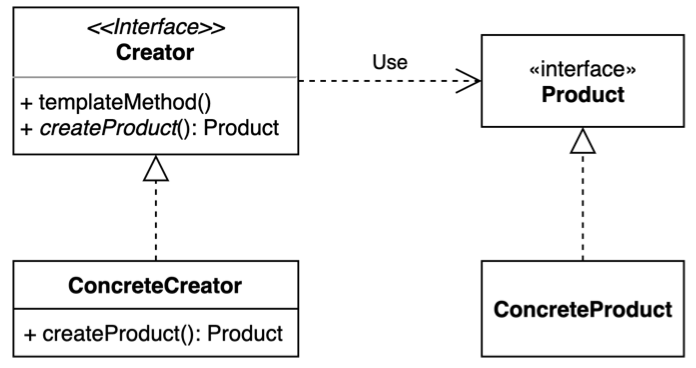
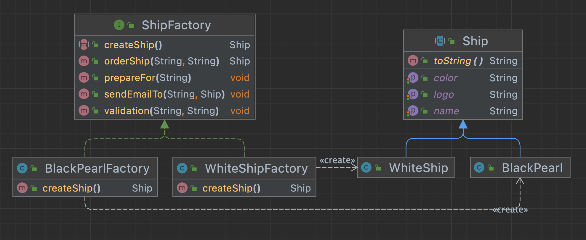

# Factory method Pattern

구체적으로 어떤 인스턴스를 만들지는 서브 클래스가 정한다.



다양한 구현체 (Product)가 있고, 그중에서 특정한 구현체를 만들 수 있는 다양한 팩토리 (Creator)를 제공할 수 있다.

- 확장에는 열려 있고 변경에는 닫혀져 있는 OCP(Open-Close Principle) 를 지키기 위한 설계 방법중 하나다.
- 기존 Product 코드 변경 없이, 확장에 용이한 구조로 설계할 수 있다.
- 다만 기존 Product 코드를 확장하기 위해 도출된 구체적인 팩토리 클래스는 클라이언트가 알고 있어야 되기 때문에 클라이언트 코드가 변경되는건 당연하다.

### 구현 방법



1. 팩토리 메소드 패턴은 직접적인 객체 생성을 팩토리(Creator) 클래스 내부에 지정된 메서드를 통해 인스턴스 생성(Product)을 하도록 정의한다.
2. Creator에선 Product 생성 세부 정보를 다룬다.
3. Creator는 다형성 생성을 위해 인터페이스를 반환한다.
4. 하위 Creator 클래스에선 구체적인 Product 클래스를 생성한다.
5. 여러 유형의 Product 구현 클래스에선 구현 세부 정보를 다룬다.

### 장/단점

| 장점| 단점  |
|---|-----|
| - Product와 Creator 느슨한 결합이 도출된다.<br/> - SRP(Single Responsibility Principle): Creator 에서 Product 인스턴스 생성과 관련된 코드만 다루게 된다.<br/> - OCP(Open/Closed Principle): 클라이언트의 코드 수정 없이 새로운 유형의 Product 클래스를 추가할 수 있다. |인스턴스 생성과 세부 정보, 각자의 역할을 나누다보니 패턴을 구현하기 위해 많은 새 하위 클래스를 도입해야 하므로 코드가 더 복잡해질 수 있다.|

### Simple Factory Pattern

매개변수의 값에 따라 또는 메소드에 따라 각기 다른 인스턴스를 리턴하는 단순한 버전 의 팩토리 패턴

```java
public class SimpleFactory {

  public Object createProduct(String name) {
    if ("whiteship".equals(name)) {
      return new WhiteShip();
    }

    if ("blackPearl".eqauls(name)) {
      return new BlackPearl();
    }
  }
}
```

- java.lang.Calendar
  - Calendar.getInstance().getClass()
  - Calendar.getInstance().getClass("Locale.forLangu)
- java.lang.NumberFormat

### 실무에서는 어떻게 쓰이나?
    - java.lang.Calendar 또는 java.lang.NumberFormat
- 스프링 BeanFactory
    - Object 타입의 Product를 만드는 BeanFacotry라는 Creator!