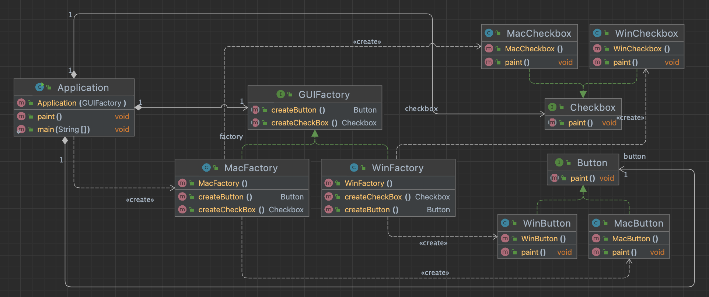

# Abstract factory Pattern

서로 관련있는 여러 객체를 만들어주는 인터페이스.

- 구체적으로 어떤 클래스의 인스턴스를(concrete product)를 사용하는지 감출 수 있다.


- 클라이언트의 초점에서 객체를 생성하는 패턴으로 팩토리 메서드 패턴이 응용된 패턴이다.
- 클라이언트 코드에서 구체적인 클래스의 의존성을 제거하는 목적이 있다.
- Product 객체와 관계를 이루는 다양한 종류의 집합군(families)을 느슨한 결합을 통해 유연한 확장성을 제공한다.

### 구현 방식



```java
public interface Button { }
public class MacButton implements Button { }
public class WinButton implements Button { }

public interface Checkbox { }
public class MacCheckbox implements Checkbox { }
public class WinCheckbox implements Checkbox { }

public interface GUIFactory {
	Button createButton();
	Checkbox createCheckbox();
}

public class MacFactory implements GUIFactory {
	@Override
	public Button createButton() {
		return new MacButton();
	}

	@Override
	public Checkbox createCheckBox() {
		return new MacCheckbox();
	}
}

public class Application {
	private final GUIFactory factory;
	private final Button button;
	private final Checkbox checkbox;

	public Application(GUIFactory factory) {
		this.factory = factory;
		this.button = factory.createButton();
		this.checkbox = factory.createCheckBox();
	}

	public void paint() {
		button.paint();
		checkbox.paint();
	}

	public static void main(String[] args) {
		Application application = new Application(new MacFactory());
		application.paint();
	}
}
```

### Factory method vs Abstract factory

- 모양과 효과는 비슷하지만...
    - 둘 다 구체적인 객체 생성 과정을 추상화한 인터페이스를 제공한다.
- 관점이 다르다.
    - 팩토리 메소드 패턴은 팩토리를 구현하는 방법 (inheritance)에 초점을 둔다.
    - 추상 팩토리 패턴은 팩토리를 사용하는 방법 (composition)에 초점을 둔다.
- 목적이 조금 다르다.
    - 팩토리 메소드 패턴은 구체적인 `객체 생성 과정`을 하위 또는 구체적인 클래스로 옮기는 것이 목적.
    - 추상 팩토리 패턴은 `관련있는 여러 객체`를 구체적인 클래스에 의존하지 않고 만들 수 있게 해주는 것이 목적.
