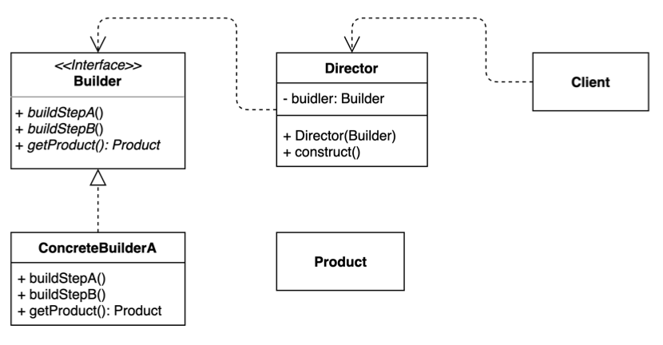

# Builder Pattern

동일한 프로세스를 거쳐 다양한 구성의 인스턴스를 만드는 방법.



- (복잡한) 객체를 만드는 프로세스를 독립적으로 분리할 수 있다.
- 복잡한 객체를 단계별로 구성하는 데 중점을 둔다.

### 이슈, 객체 생성의 문제

인스턴스 생성에 어려움은 크게 다음과 같다.

- 객체 내부에 존재하는 많은 `필드`
- 객체 내부에 `중첩된 객체`가 존재하는 구조

이런 코드 대부분은 생성자에 많은 매개 변수를 포함하고 있고, 심지어 클라이언트 코드 전체에 흩어져 있다.

```java
public class Application {
  public static void main(String[] args) {
    House defaultHouse = new House(3, 2, 3, null, null, null);
    House hotel = new House(3, 2, 3, true, true, true);
  }
}
```

다음 문제는 하위 클래스를 구성하여 인스턴스 다형성 생성을 지원하는 방법도 존재지만, 
다양한 객체를 지원하기 무수히 많은 하위 클래스를 구성해야되고 관리 포인트가 늘어난다는 단점이 존재한다.

하위 클래스를 구성하지 않는 방식으로 접근하려면, 다양한 생성자를 구성하면 되지만, 이 역시 객체안에 수 많은 생성자가 구성될 수 있다.

```java
// 다양한 생성자 구성
House house = new House(3, 2, 3, null, null, null);
House defaultHouse = new House(3, 2, 3);
```

빌더 패턴은 복잡한 객체를 단계별로 구성하는 데 중점을 둔다.

### 구현 방법

```java
// Product
public class House {
  private int windows;
  private int doors;
  private int rooms;
  private Boolean hasGarage;
  private Boolean hasSwimPool;
  private Boolean hasStatues;

  public House(int windows, int doors, int rooms, Boolean hasGarage, Boolean hasSwimPool, Boolean hasStatues) {
    this.windows = windows;
    this.doors = doors;
    this.rooms = rooms;
    this.hasGarage = hasGarage;
    this.hasSwimPool = hasSwimPool;
    this.hasStatues = hasStatues;
  }

  // getter, setter
}

// Builder
public interface HouseBuilder {
  HouseBuilder windows(int windows);
  HouseBuilder doors(int doors);
  HouseBuilder rooms(int rooms);
  HouseBuilder houseOption(Boolean hasGarage, Boolean hasSwimPool, Boolean hasStatues);
  House getHouse(); // build
}

// ConcreteBuilder
public class DefaultHouseBuilder implements HouseBuilder{
  private int windows;
  private int doors;
  private int rooms;
  private Boolean hasGarage;
  private Boolean hasSwimPool;
  private Boolean hasStatues;

  @Override
  public HouseBuilder windows(int windows) {
    this.windows = windows;
    return this;
  }

  @Override
  public HouseBuilder doors(int doors) {
    this.doors = doors;
    return this;
  }

  @Override
  public HouseBuilder rooms(int rooms) {
    this.rooms = rooms;
    return this;
  }

  @Override
  public HouseBuilder houseOption(Boolean hasGarage, Boolean hasSwimPool, Boolean hasStatues) {
    this.hasGarage = hasGarage;
    this.hasSwimPool = hasSwimPool;
    this.hasStatues = hasStatues;
    return this;
  }

  @Override
  public House getHouse() {
    return new House(windows, doors, rooms, hasGarage, hasSwimPool, hasStatues);
  }
}

// Director
@RequiredArgsConstructor
public class HouseDirector {
  private final HouseBuilder builder;

  public House defaultHouse() {
    return builder.windows(3)
            .doors(2)
            .rooms(3)
            .getHouse();
  }

  public House hotel() {
    return builder.windows(3)
            .doors(2)
            .rooms(3)
            .houseOption(true, true, true)
            .getHouse();
  }
}

// Client
public class Application {
  public static void main(String[] args) {
    HouseBuilder builder = new DefaultHouseBuilder();
    HouseDirector director = new HouseDirector(builder);

    House house = director.defaultHouse();
    House houseWithGarage = director.hotel();
  }
}
```

- Director
- builder
  - build() 인스턴스 생성전에 객체 필드 유효성 체크 또는 기본 값 설정 등 여러 행위를 할 수 있다.

### 장단점

#### 단점

- 원하는 객체를 만들려면 빌더부터 만들어야 한다.
- 구조가 복잡해 진다. (트레이드 오프)
  - 대부분의 디자인 패턴이 가지고 있는 단점으로 기존 생성 구조보다 복잡한 구조를 띈다.

#### 장점

- 복잡한 인스턴스 생성을 단순화 할 수 있다.
- 만들기 복잡한 객체를 순차적으로 만들 수 있다.
  - 설계를 잘한다면, 메서드 생성 순서를 보장할 수 있다.
  - 불완전한 객체를 사용하지 못하도록 방지할 수 있다.
- 복잡한 객체를 만드는 구체적인 과정을 숨길 수 있다.
  - Direct 객체에 인스턴스 생성 로직을 은닉할 수 있다.
- 주 생성자만 구성하여 구조를 단순화할 수 있다.
  - 인스턴스 생성과 필드 검증 로직을 분산처리 할 수 있다.
- 동일한 프로세스를 통해 각기 다르게 구성된 객체를 만들 수도 있다.
  - 빌더의 다형성을 구성하여, 다양한 인스턴스를 생성하는 로직을 구현할 수 있다.
  - 다양한 빌더를 구성하여, 확장 포인트가 될 수 있다.

### 실무에서 어떻게 쓰이나?

- Java 8 Stream.Builder API
- StringBuilder
- [Lombok @Builder](https://projectlombok.org/features/Builder)
- Spring
    - UriComponentsBuilder
    - MockMvcWebClientBuilder
    - *Builder
