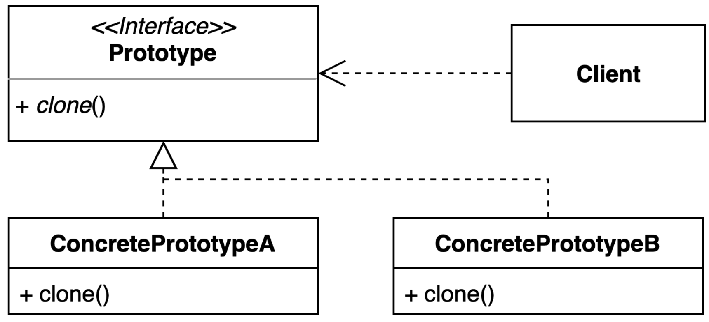

# Prototype Pattern

기존 인스턴스를 복제하여 새로운 인스턴스를 만드는 방법

- 복제 기능을 갖추고 있는 기존 인스턴스를 프로토타입으로 사용해 새 인스턴스를 만들 수 있다.



## 이슈

- 기존의 객체가 생성하는데 시간이 오래 걸리는 경우
  - 예를 들어 외부 리소스를 기반으로 생성되는 경우, 생성 비용이 크기 때문에 기존 생성된 인스턴스를 기준으로 복사하여 필요에 의해 특정 필드만 변경하여 사용
- 객체의 일부 필드는 비공개일 경우엔 모든 객체를 복사할 순 없다.
- 직접 접근 방식의 문제
  - 복제본을 생성하려면 객체의 클래스를 알아야 함으로 해당 클래스에 종속된다.

### Deep Copy VS Shallow Copy

프로토타입 패턴은 기존 객체를 복사하여 새로운 인스턴스를 생성하는 디자인 패턴으로, 깊은 복사와 얕은 복사의 차이를 숙지해야 한다.

### 깊은 복사(Deep Copy)

- "실제 값"을 새로운 메모리 공간에 복사(힙 영역)
- 새로운 메모리에 할당하는 방식으로 메모리 사용량이 증가할 수 있다.
- 안전하게 참조 타입 객체를 수정할 수 있다.

### 얕은 복사(Shallow Copy)

- "주소 값"을 복사(스택 영역)
- 메모리 사용량을 줄일 수 있고, 빠른 성능을 보장한다.
- 참조하는 주소 값을 복사하기 때문에, 참조하고 있는 실제 값은 같다.

얕은 복사일 경우 원시 타입(Primitive type) 값들은 복사가 이뤄지고, 참조 타입(Reference type) 객체는 새로운 객체를 생성하지 않고 항상 주소값을 복사한다. 따라서 객체 내부 필드가 참조 타입 객체라면 해당 객체도 명시적으로 깊은 복사가 이뤄지도록 해야 한다. 

단 참조 타입의 객체가 불변이라면 굳이 깊은 복사할 필요는 없다.

## 구현 방법

기존 인스턴스를 복제하여 새로운 인스턴스를 만드는 방법

- `Clonable` 인터페이스를 구현하여 clone() 메소드를 오버라이딩 하여 복사
- ~~복사 생성자(copy constructor)~~
- ~~복사 팩토리(copy factory)~~

```java
@NoArgsConstructor
@Getter
@Setter
@EqualsAndHashCode
@ToString
public class Notice implements Cloneable{
	private String title;
	private String content;
	private boolean enabled;
	private List<String> comments;

	// Copy Constructor
	public Notice(Notice that) {
		this.title = that.title;
		this.content = that.content;
		this.enabled = that.enabled;
		this.comments = new ArrayList<>(that.comments);
	}

	// Shallow Copy
	@Override
	public Object clone() {
		try {
			return super.clone();
		} catch (CloneNotSupportedException e) {
			throw new RuntimeException(e);
		}
	}

	// Deep Copy
	public Notice deepCopy() {
		return new Notice(this);
	}
}

public class Application {
  public static void main(String[] args) {
    Notice notice = new Notice();
    notice.setTitle("제목");
    notice.setContent("내용");
    notice.setEnabled(true);
    notice.setComments(new ArrayList<>(Arrays.asList("댓글1", "댓글2")));


    // shallow copied
    Notice clone = (Notice)notice.clone();
    assert isEqualsSystemHashCode(notice.getTitle(), clone.getTitle());
    assert isEqualsSystemHashCode(notice.getContent(), clone.getContent());
    assert isEqualsSystemHashCode(notice.isEnabled(), clone.isEnabled());

    assertCopiedObject(notice, clone);
    assertShallowCopiedObject(notice, clone);

    // deep copied
    Notice deepCopied = notice.deepCopy();
    assertCopiedObject(notice, deepCopied);
    assertDeepCopiedObject(notice, deepCopied);
  }

  private static void assertCopiedObject(Object origin, Object clone) {
    assert origin != clone;
    assert origin.equals(clone);
    assert origin.getClass() == origin.getClass();
  }

  private static void assertDeepCopiedObject(Notice notice, Notice clone) {
    notice.setTitle("제목 수정");
    notice.setContent("내용 수정");
    notice.setEnabled(false);
    assert isEqualsSystemHashCode(notice.getTitle(), clone.getTitle());
    assert isEqualsSystemHashCode(notice.getContent(), clone.getContent());
    assert isEqualsSystemHashCode(notice.isEnabled(), clone.isEnabled());

    List<String> noticeComments = notice.getComments();
    String newComment = "신규 댓글";
    noticeComments.add(newComment);

    assert !isEqualsSystemHashCode(notice.getComments(), clone.getComments());
    assert !clone.getComments().contains(newComment);
  }

  // shallow copy 참조 타입 검증
  private static void assertShallowCopiedObject(Notice notice, Notice clone) {
    notice.setTitle("제목 수정");
    notice.setContent("내용 수정");
    notice.setEnabled(false);
    assert !isEqualsSystemHashCode(notice.getTitle(), clone.getTitle());
    assert !isEqualsSystemHashCode(notice.getContent(), clone.getContent());
    assert !isEqualsSystemHashCode(notice.isEnabled(), clone.isEnabled());

    // 참조 타입 주소 값을 복사하기 때문에 원본 객체와 복사된 객체간 공유한다.
    // 복사된 참조 타입 데이터를 수정시 원본 Object 데이터도 변경 위험이 따른다.
    List<String> noticeComments = notice.getComments();
    String newComment = "신규 댓글";
    noticeComments.add(newComment);
    assert isEqualsSystemHashCode(notice.getComments(), clone.getComments());
    assert clone.getComments().contains(newComment);
  }

  private static boolean isEqualsSystemHashCode(Object o1, Object o2) {
    return System.identityHashCode(o1) == System.identityHashCode(o2);
  }
}
```

## 장단점

### 장점

- 복잡한 객체를 만드는 과정을 숨길 수 있다.
- 기존 객체를 복제하는 과정이 새 인스턴스를 만드는 것보다 비용(시간 또는 메모리)적인 면에서 효율적일 수도 있다.
- 추상적인 타입을 리턴할 수 있다.

### 단점

- 복제한 객체를 만드는 과정 자체가 복잡할 수 있다. (특히, 순환 참조가 있는 경우)

## 실무에서 어떻게 쓰이나?

- Java Object 클래스의 clone 메소드와 Cloneable 인터페이스
- shallow copy와 deep copy
- ModelMapper

## Reference

- [Josh Bloch on Design A Conversation with Effective Java Author, Josh Bloch](https://www.artima.com/articles/josh-bloch-on-design#part13) <br/>
- [stackoverflow - clone vs copy constructor vs factory method](https://stackoverflow.com/questions/1106102/clone-vs-copy-constructor-vs-factory-method)