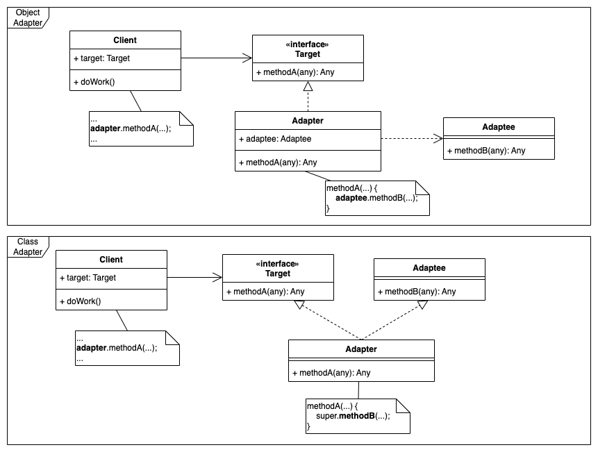

# Adapter Pattern

- 기존 코드를 클라이언트가 사용하는 인터페이스의 구현체로 바꿔주는 패턴
- 클라이언트가 사용하는 인터페이스를 따르지 않는 기존 코드를 재사용할 수 있게 해준다.

- `Target`: Client Interface
- `Adaptee`: 3rd-party 또는 레거시 클래스
  - 클라이언트와 호환되지 않는 인터페이스를 구현한 클래스로 직접 사용 불가
- `Adapter`: Client 와 `Adaptee` 모두 사용할 수 있도록 도와주는 클래스

## 이슈

타 시스템의 Component 는 다양한 기능을 제공하고 있어 재사용하고 싶지만, 현재 개발중인 시스템의 개발 철학과 아키텍처와 호환되지 않는다면?

- 사용할 객체가 기존 인터페이스랑 호환되지 않는 인터페이스일 경우
- 클래스의 인터페이스를 클라이언트가 기대하는 다른 인터페이스로 변환할 경우

## 구현 방식

기존 코드를 클라이언트가 사용하는 인터페이스의 구현체로 바꿔주는 패턴

- Object Adapter
  - Composition 기반으로 설계
  - `Adapter` 클래스는 `Adaptee` 구성 요소를 지닌 Wrapper 클래스 구조
- Class Adapter
  - Inheritance 기반으로 설계
  - `Adapter` 클래스는 `Target` 과 `Adaptee` 인터페이스를 상속받는 [Multiple inheritance](https://en.wikipedia.org/wiki/Multiple_inheritance) 구조

## 장단점

### 장점

- 기존 소스 코드 수정 없이, 3rd-party 기능 사용
  - 기존 코드를 변경하지 않고 원하는 인터페이스 구현체를 만들어 재사용할 수 있다.
- 기존 코드가 하던 일과 특정 인터페이스 구현체로 변환하는 작업을 각기 다른 클래스로 분리하여 관리할 수 있다.

### 단점

- 새 클래스가 생겨 복잡도가 증가할 수 있다. 
- 경우에 따라서는 기존 코드가 해당 인터페이스를 구현하도록 수정하는 것이 좋은 선택이 될 수도 있다.

## 실무에서 어떻게 쓰이나?

- Java
  - java.util.Arrays#`asList(T...)`
  - java.util.Collections#`list(Enumeration)`
  - java.util.Collections#`enumeration()`
  - java.io.InputStreamReader(InputStream)
  - java.io.OutputStreamWriter(OutputStream)
- Spring
  - `HandlerAdapter`: 우리가 작성하는 다양한 형태의 핸들러 코드를 스프링 MVC가 실행할 수 있 는 형태로 변환해주는 어댑터용 인터페이스.