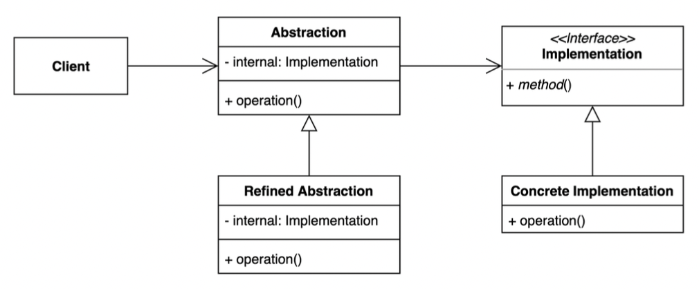
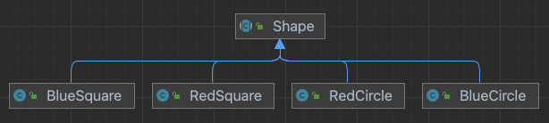
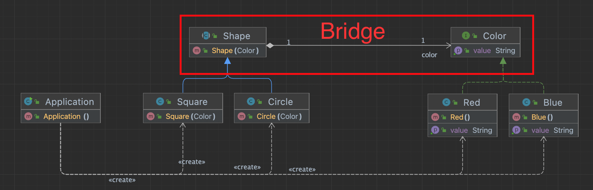

# Bridge Pattern

큰 클래스 또는 밀접하게 관련된 클래스 집합을 `서로 독립적으로 개발`할 수 있는 두 개의 개별 계층(추상화 및 구현)으로 분할할 수 있는 구조적 디자인 패턴

- 추상적인 것과 구체적인 것을 분리하여 연결하는 패턴
- 하나의 계층 구조일 때 보다 각기 나누었을 때 독립적인 계층 구조로 발전 시킬 수 있다
- 캡슐화를 넘어 분리와 격리
- 추상클래스를 사용한 방식이 아닌 Composition 사용



- `Client`: Abstraction 클래스 사용
    - 추상화 개체를 구현 개체와 연결하는 작업
- `Abstraction`: 고차원적인 추상적인 로직 제공
    - Implementation Composition (Bridge)
    - 추상화와 구현의 wrapper 클래스
- `Refined Abstraction`: 추상적인 개념을 다양한 변형체
    - 또 다른 계층 구조로 확장 가능한 확장 포인트
- `Implementation`: 공통적인 구체적인 구현에 대한 인터페이스
    - Abstraction 는 `Implementation`가 제공하는 메서드만 사용
    - 세부적인 구현 클래스에 대한 높은 수준의 논리 제공
- `Concrete Implementation`: 별도의 계층 구조로 발전시킬 수 있다.
    - 또 다른 계층 구조로 확장 가능한 확장 포인트

## 이슈

Shape 추상 클래스와 색상과 모형을 통합한 계층 구조로 되어 있다고 가정해보자.

새로운 색상을 도출해야된다면, 중복된 색상 로직을 제공해야되고 이에 맞게 많은 하위 클래스를 구성해야 한다.



- Orthogonal 클래스 계층을 구성할 때
- Implementation runtime binding
- 인터페이스와 결합된 수많은 구현으로 인해 하위 클래스가 증가할 경우
- 구현 클래스가 여러 객체에서 의존된 경우

## 구현 방식



```java
// Abstraction
public abstract class Shape {

  // Composition
  private final Color color; // bridge

  public Shape(Color color) {
    this.color = color;
  }

  abstract String getName();

  public void print() {
    System.out.printf("%s %s\n", color.getValue(), getName());
  }
}

// Refined Abstraction 1
public class Circle extends Shape {
  public Circle(Color color) {
    super(color);
  }
  
  @Override
  String getName() {
    return "circle";
  }
}

// Refined Abstraction 2
public class Square extends Shape {
  public Square(Color color) {
    super(color);
  }
  
  @Override
  String getName() {
    return "square";
  }
}
```

```java
// Implementation
public interface Color {
  String getValue();
}

// Concrete Implementation 1
public class Blue implements Color {
  @Override
  public String getValue() {
    return "blue";
  }
}

// Concrete Implementation 2
public class Red implements Color {
  @Override
  public String getValue() {
    return "red";
  }
}
```

```java
// Client
public class Application {
  public static void main(String[] args) {
    Shape square = new Square(new Red());
    square.print();  

    Shape circle = new Circle(new Blue());
    circle.print();
  }
}
```

## 장단점

### 장점

- 추상적인 코드를 구체적인 코드 변경 없이도 독립적으로 확장할 수 있다.
  - OCP, 기존 구조 변경 없이 확장 가능
- 추상적인 코드과 구체적인 코드를 분리하여 수 있다.
  - SRP, 하나의 책임만 제공 

### 단점

- 계층 구조가 늘어나 복잡도가 증가할 수 있다.

## 실무에서 어떻게 쓰이나?

- Java
    - SLF4J, 로깅 퍼사드와 로거 스프링
        - `Logger logger = LoggerFactory.getLogger(Sl4jExaple.class);`
    - JDBC API, `DriverManger` 와 `Driver`
- Spring
    - Portable Service Abstraction
        - Implementation
            - MailSender
            - PlatformTransactionManager `<->` TransactionTemplate(Abstraction)