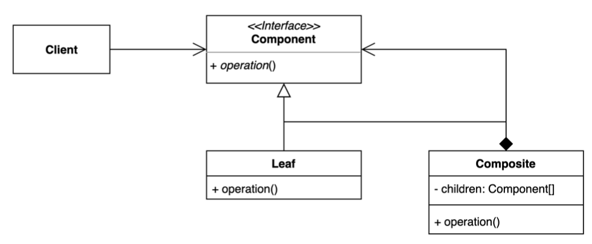

# Composite Pattern

그룹 전체와 개별 객체를 동일하게 처리할 수 있는 패턴.

- 클라이언트 입장에서는 `전체`나 `부분`이나 모두 동일한 컴포넌트로 인식할 수 있는 `계층 구조`를 만든다. (Part-Whole Hierarchy)
- 특정한 구조(트리)로 제한이 있다.



- Client: 일반화된 Component 인터페이스 사용
    - 모든 요소가 동일한 방식으로 동작되도록 위함
    - 클라이언트는 각 요소의 로직의 복잡성과 무관하게 동일한 방식으로 작업할 수 있다.
- Component: 모든 트리의 요소에서 공통적으로 처리할 로직을 일반화한 인터페이스
- Leaf: 하위 요소가 없는 트리의 기본 요소
- Composite(Container): 그룹을 표현할 수 있는 객체
    - 하위 요소(Leaf or Composite)가 있는 트리의 요소
    - 하위 요소는 Component 타입으로 정의되기 때문에 하위 구현체를 알지 못한다.

## 이슈

- 클라이언트는 계층적인 Collection 을 연산할 경우가 필요하다.
  - 클라이언트는 연산 과정에서 구체적인 클래스를 알필요는 없다.
- 단. 인터페이스를 통해 동일한 방식으로 원하는 로직을 처리할 수 있어야 한다.

## 구현 방식

```java
// Client
public class Application {

  public static void main(String[] args) {
    Item note = Item.create("note", 1_000);
    Item pencil = Item.create("pencil", 3_000);
    Item eraser = Item.create("eraser", 500);

    Basket basket = new Basket();
    basket.add(note);
    basket.add(pencil);
    basket.add(eraser);

    System.out.println(note.getPrice());
    System.out.println(basket.getPrice());
  }
}

// Component
public interface Order {
  int getPrice();
}

// Leaf
@Getter
public class Item implements Order {
  private String name;
  private int price;

  public static Item create(String name, int price) {
    Item item = new Item();
    item.name = name;
    item.price = price;
    return item;
  }
}

// Composite
@Getter
public class Basket implements Order {

  // child component
  private final List<Order> values = new ArrayList<>();

  public void add(Order order) {
    values.add(order);
  }

  @Override
  public int getPrice() {
    return values.stream()
            .mapToInt(Order::getPrice)
            .sum();
  }
}
```

## 장단점

### 장점

- 복잡한 트리 구조를 편리하게 사용할 수 있다.
- 다형성과 재귀를 활용할 수 있다.
- OCP, 클라이언트 코드를 변경하지 않고 새로운 엘리먼트 타입을 추가할 수 있다.

### 단점

- 트리를 만들어야 하므로 (공통된 인터페이스를 정의해야 하므로) 지나치게 일반화해야 하는 경우도 생길 수 있다.
- 기능이 너무 상이할 경우 일반화하여 인터페이스를 제공하기 어려울 수 있다.

## 실무에서 어떻게 쓰이나

- Java
  - Swing 라이브러리
  - JSF(JavaServer Faces) 라이브러리