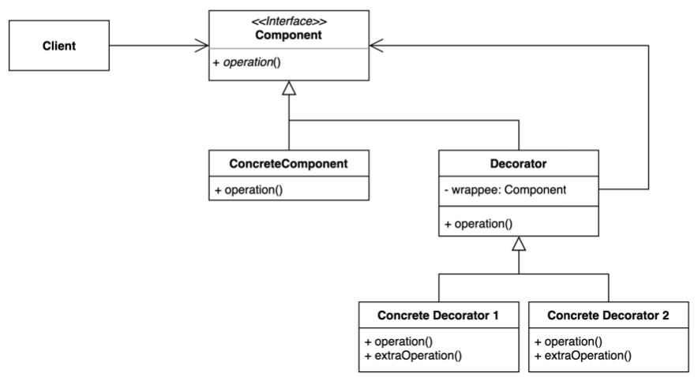

# Decorator Pattern

데코레이터는 동작을 포함하는 특수 래퍼 개체 내부에 이러한 개체를 배치하여 개체에 새 동작을 추가할 수 있는 구조적 디자인 패턴이다.



- 기존 코드를 변경하지 않고 부가 기능을 추가하는 패턴
- 상속이 아닌 위임(Delegation)을 사용해서 보다 유연하게, 런타임시 전혀 다른 책임을 지닌 객체의 행위를  추가할 수 있다.
- `Decorator`의 경우 Wrapper 라고도 한다.
  - 클라이언트는 재귀적인 래핑(wrapping)한 인터페이스를 호출한다.
- 위임이란 어떤 행위를 위임 관계에 있는 객체에게 넘겨서 처리하는 것을 의미한다. Composition + Forwarding 이라고 보면 될 것 같다.
- 인터페이스에 대한 메서드 추가가 아닌, 객체의 책임을 추가하는 방식

## 이슈

- 런타임에 개별 개체에 동작 또는 상태를 추가해야될 경우
- 상속은 정적(Compile 시점에 적용)이며 전체 구현 클래스에 적용된다.
- 다중 상속을 지원하지 않는 프로그래밍 언어를 사용할 경우

## 구현 방식

```java
// Client
public class Application {

  private boolean useNotificationOfSlack = true;
  private boolean useNotificationOfFacebook = true;

  public static void main(String[] args) {
    Application client = new Application();

    NotificationService notificationService = new DefaultNotificationService();
    if (client.useNotificationOfSlack) {
      notificationService = new SlackDecorator(notificationService);
    }

    if (client.useNotificationOfFacebook) {
      notificationService = new FacebookDecorator(notificationService);
    }

    String comment = "신규 댓글 등록";
    notificationService.addComment(comment);
  }
}

// Component
public interface NotificationService {

  void addComment(String comment);
}

// ConcreteComponent
public class DefaultNotificationService implements NotificationService {
  
  @Override
  public void addComment(String comment) {
    System.out.println("Notification on Application. comment: " + comment);
  }
}


// Decorator
public abstract class SmsNotificationWrapper implements NotificationService {

  private NotificationService notificationService;

  public SmsNotificationWrapper(NotificationService notificationService) {
    this.notificationService = notificationService;
  }

  @Override
  public void addComment(String comment) {
    notificationService.addComment(comment); // Delegation
    notifyForUser(comment);
  }

  public abstract void notifyForUser(String comment);
}

// Concrete Decorator Facebook
public class FacebookDecorator extends SmsNotificationWrapper {

  public FacebookDecorator(NotificationService notificationService) {
    super(notificationService);
  }

  @Override
  public void notifyForUser(String comment) {
    System.out.println("Notification on Facebook. comment: " + comment);
  }
}

// Concrete Decorator Slack
public class SlackDecorator extends SmsNotificationWrapper {

  public SlackDecorator(NotificationService notificationService) {
    super(notificationService);
  }

  @Override
  public void notifyForUser(String comment) {
    System.out.println("Notification on Slack. comment: " + comment);
  }
}
```

## 장단점

### 장점

- 새로운 클래스를 만들지 않고 기존 기능을 조합할 수 있다. (SRP)
  - Decorator 에 해당되는 인터페이스에 의존하고 있기 때문이다. (DIP)
- 컴파일 타임이 아닌 런타임에 동적으로 기능을 변경할 수 있다. (OCP)

### 단점

- 데코레이터를 조합하는 코드가 복잡할 수 있다.

## 실무에서 어떻게 쓰이나

- Java
  - `InputStream`, `OutputStream`, `Reader`, `Writer`의 생성자를 활용한 랩퍼
  - `java.util.Collections`가 제공하는 메소드들 활용한 랩퍼
  - `javax.servlet.http.HttpServletRequest`, `javax.xml.ws.ResponseWrapper`
- Spring
  - ServerHttpRequestDecorator