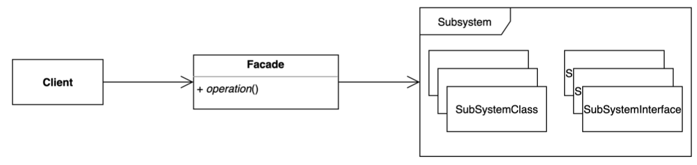

# Facade Pattern

- Facade 는 "건물의 정면"을 의미하는 단어이다.
- 복잡한 서브 시스템 의존성을 최소화하는 방법
- 클린코드에서 말하는 깨끗한 경계와 비슷한 맥락으로 보인다.
- 하위 시스템의 인터페이스 집합에 통합 인터페이스를 제공
  - 클라이언트가 사용해야 하는 복잡한 서브 시스템 의존성을 간단한 인터페이스로 추상화 할 수 있다.
  - `Facade`는 하위 시스템을 사용하기 쉽게 만드는 상위 수준 인터페이스를 정의
  - 복잡한 하위 시스템을 더 단순한 인터페이스로 래핑하는 구조적 디자인 패턴이다.



## 이슈

- 클라이언트가 복잡한 하위 시스템의 전체 기능에 대한 단순화된 인터페이스 필요할 경우
- 일반적으로 어느 클래스의 비즈니스 로직이 타사 클래스의 구현 세부 정보와 밀접하게 의존되어 있다면, 해당 로직은 이해하기 어렵고 유지 관리하기가 매우 어렵다.

## 구현 방식

```java
// Client
public class Application {

  public static void main(String[] args) {
    // Sub System
    DatabaseService databaseService = new DatabaseService(); 
    AmqpService amqpService = new AmqpService();
    EmailSender emailSender = new EmailSender();

    // Facade
    SystemService service = new SystemService(databaseService, amqpService, emailSender);

    service.checkHealth();
  }
}

// Facade
@RequiredArgsConstructor
public class SystemService {

  // Sub System
  private final DatabaseService databaseService;
  private final AmqpService amqpService;
  private final EmailSender emailSender;

  public void checkHealth() {
    sendMailIfExceedHealthThreshold(this::checkHealthOfRabbitMQ, 15);
    sendMailIfExceedHealthThreshold(this::checkHealthOfDatabase, 85);
  }

  public void sendMailIfExceedHealthThreshold(Consumer<Integer> checker, int threshold) {
    try {
      checker.accept(threshold);
    } catch (Exception e) {
      emailSender.sendMessage(e.getMessage());
    }
  }

  private void checkHealthOfRabbitMQ(int threshold) {
    int current = amqpService.getQueueTotalsOfMessagesUnacknowledged();
    if (threshold < current) {
      throw new SystemException(String.format("[MQ] Unacknowledged message count over. threshold:%s, unackedMessageCount:%s", threshold, current));
    }
  }

  private void checkHealthOfDatabase(int threshold) {
    int usage = databaseService.getCurrentConnectionCount();
    if (threshold < usage) {
      throw new SystemException(String.format("[DB] Connection count over. threshold=%d, usage=%d", threshold, usage));
    }
  }
}
```

## 장단점

### 장점

- 서브 시스템에 대한 의존성을 한 곳으로 모을 수 있다.

### 단점

- 퍼사드 클래스가 서브 시스템에 대한 모든 의존성을 가지게 된다.

## 실무에서 어떻게 쓰이나

- SLF4J (Simple Logging Facade for Java)
- Spring
  - Spring MVC
  - 스프링이 제공하는 대부분의 기술 독립적인 인터페이스와 그 구현체