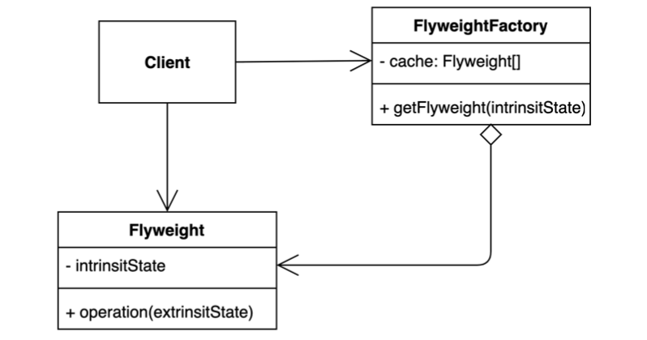

# Flyweight Pattern

- 객체를 가볍게 만들어 메모리 사용을 줄이는 패턴.
- 자주 변하는 속성(또는 외적인 속성, `extrinsic`)과 변하지 않는 속성(또는 내적인 속성, `intrinsic`)을 분리하고 재사용하여 메모리 사용을 줄일 수 있다.



- Flyweight
  - Immutability
- FlyweightFactory
  - Flyweight 인스턴스 생성 및 caching 역할

## 이슈

객체 생성 비용이 크거나 객체 내부 관리되는 데이터가 많아 메모리 소비가 클 경우 고려야해야 할 경우

객체 내부의 상태엔 크게 두가지로 구분 할 수 있다.

- the state-dependent (extrinsic) part
  - 외부 상태는 Flyweight 객체에 의해 클라이언트의 계산 작업이나 데이터들을 관리한다.
  - 자주 변하는 것, 외적인 속성, 본질적이지 않는 것
- the state-independent (intrinsic) part
  - 내부 상태는 Flyweight 객체에 저장되고 공유된다.
  - 잘 변하지 않는 것, 내적인 속성, 본질적인 것

Flyweight 패턴은 고유 상태(intrinsic state) 는 상수로 정의하여 재사용하도록 설계하고, 외부 상태(Extrinsic state) 를 내부에서 관리하지 않도록 제안한다.

## immutability

Flyweight 의 공통된 상태들은 다른 객체간에서 공유함으로 반드시 상태는 불변성(immutability)을 지녀야 한다.

- 읽기는 가능하고 수정은 불가능해야 한다.
- 초기화는 단 한번만 이뤄져야 한다.
- setter 또는 public 은 외부에서 접근하지 못하도록 설계해야 한다.

## 구현 방식

```java
// Client
public class Application {

  public static void main(String[] args) {
    FontFactory fontFactory = new FontFactory();
    Character c1 = new Character('h', "white", fontFactory.getFont("nanum:12"));
    Character c2 = new Character('e', "white", fontFactory.getFont("nanum:12"));
    Character c3 = new Character('l', "white", fontFactory.getFont("nanum:12"));

    assert isEqualsSystemHashCode(c1.getFont(), c2.getFont());
    assert isEqualsSystemHashCode(c1.getFont(), c3.getFont());
  }

  private static boolean isEqualsSystemHashCode(Object o1, Object o2) {
    return System.identityHashCode(o1) == System.identityHashCode(o2);
  }
}
```

```java
// Flyweight Immutability
@Getter
@RequiredArgsConstructor
public final class Font {

  private final String family;
  private final int size;
}
```

```java
// Flyweight Factory
public class FontFactory {

  private static final Map<String, Font> CACHE = new HashMap<>();

  public Font getFont(String findFont) {
    Font font = CACHE.get(findFont);
    if (font == null) {
      String[] split = findFont.split(":");
      String family = split[0];
      int size = Integer.parseInt(split[1]);

      Font newFont = new Font(family, size);
      CACHE.put(findFont, newFont);
      return newFont;
    }

    return font;
  }
}
```

## 장단점

### 장점

- 애플리케이션에서 사용하는 메모리를 줄일 수 있다.

### 단점

- 코드의 복잡도가 증가한다.

## 실무에서 어떻게 쓰이나

- [Integer#valueOf(int i)](https://docs.oracle.com/javase/8/docs/api/java/lang/Integer.html#valueOf-int-)