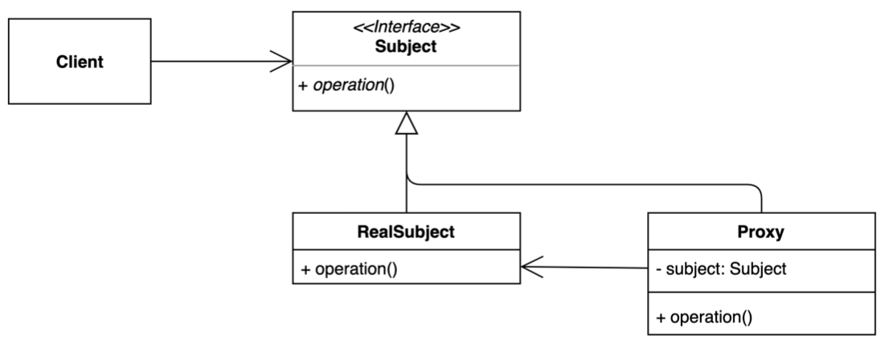

# Proxy Pattern

- 특정 객체에 대한 `접근을 제어`하거나 기능을 추가할 수 있는 패턴
- 과도한 복잡성으로부터 실제 구성 요소를 보호하기 위해 래퍼(wrapper) 및 위임(delegation)을 사용하는 디자인 패턴
- 기존 오퍼레이션 전, 검증, 캐싱 등 다양하게 응용해 사용할 수 있다.
  - 초기화 지연 (lazy initialization)
  - 접근 제어
  - 로깅
  - 캐싱



## 이슈

지연 초기화를 구현해야할 경우

- 인스턴스 생성 비용이 많은 객체를 클라이언트가 실제로 요청하기 전까지 인스턴스화 하지 않도록 해야될 경우

## 구현 방식

```java
// Client
public class Application {

  public static void main(String[] args) {
    GameService service = new ProxyGameService();

    service.startGame();
  }
}
```

```java
// Subject
public interface GameService {
  
  void startGame();
}
```

```java
// RealSubject
public class DefaultGameService implements GameService {

  @Override
  public void startGame() {
    System.out.println("start game...");
  }
}
```

```java
// Proxy
public class ProxyGameService implements GameService {

  private GameService gameService; // subject

  @Override
  public void startGame() {
    long before = System.currentTimeMillis();

    if (gameService == null) {
      gameService = new DefaultGameService();
    }
    gameService.startGame();

    System.out.println(System.currentTimeMillis() - before);
  }
}
```

## 장단점

### 장점

- 기존 코드를 변경하지 않고 새로운 기능을 추가할 수 있다. (OCP)
- 기존 코드가 해야 하는 일만 유지할 수 있다. (SRP)
- 기능 추가 및 초기화 지연 등으로 다양하게 활용할 수 있다.

### 단점

- 코드의 복잡도가 증가한다.
- 응답이 늦어질 수 있다.

## Proxy VS Decorator

두 패턴 모두 래퍼(wrapper) 개체가 일부 작업을 기존 개체에 위임(delegation) 하는 구성 원칙을 기반한다. 

- 목적의 차이
  - Proxy 패턴은 `제어의 목적`
  - Decorator 패턴은 `기능 확장`
- 객체의 생명 주기 관점의 차이
  - Proxy 패턴은 `서비스 측면에서 통합적으로 생명 주기를 관리` 
  - Decorator 패턴에서 생명 주기는 항상 `클라이언트에 의해 제어`

## 실무에서 어떻게 쓰이나

- 다이나믹 프록시, java.lang.reflect.Proxy
- Spring AOP