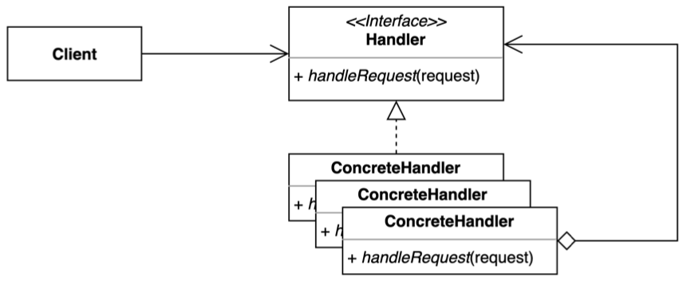
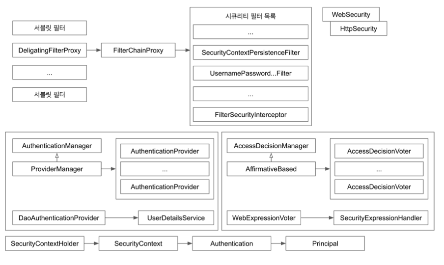

# Chain of responsibility Pattern

- **`책임 연쇄 패턴`** 은 요청을 보내는 쪽(sender)과 요청을 처리하는 쪽(receiver)의 분리하는 패턴
- 특정한 하나의 책임을 지닌 클래스들이 여러 집합으로 연쇄적으로 처리하는 방식 
- 클라이언트의 요청을 처리하기 위해 객체들을 체인 형태로 연결하여 결합력(decoupling)을 낮추기 위해 사용한다.
- 핸들러 체인을 사용해서 요청을 처리한다.
  - 핸들러를 어떻게 설계하느냐에 따라 결정 된다.
  - 클라이언트는 체인이 어떻게 구성되어 있는지 알 필요가 없다.
  - 즉 클라이언트(요청을 보내는쪽) 코드와 decoupling 되어 있다.



## 이슈

- 특정 요청에 대해 처리 해야될 요청 스트림이 존재한다고 가정하자.
- 요청 스트림은 단일 책임 원칙에 따라 여러 클래스 구현되어 있다.
- 요청에 대해 클래스에 대한 우선 순위은 가변적으로 파이프라인을 구현해야 한다면?

## 구현 방식

```java
// Client
public class Application {

  private final RequestHandler requestHandler;

  public Application(RequestHandler requestHandler) {
    this.requestHandler = requestHandler;
  }

  private void doWork() {
    Request request = new Request("{id: \"gmoon\"}");
    requestHandler.handle(request);
  }

  public static void main(String[] args) {
    RequestHandler chain = new PrintRequestHandler(new AuthRequestHandler());
    Application client = new Application(chain);
    client.doWork();
  }
}
```

```java
// Handler
public abstract class RequestHandler {

  private RequestHandler nextHandler;

  public RequestHandler() {

  }

  public RequestHandler(RequestHandler nextHandler) {
    this.nextHandler = nextHandler;
  }

  abstract void preProcessor(Request request);

  public void handle(Request request) {
    preProcessor(request);

    if (nextHandler != null) {
      nextHandler.handle(request);
    }
  }
}
```

```java
// ConcreteHandler 1
public class AuthRequestHandler extends RequestHandler {

  public AuthRequestHandler() {
  }

  public AuthRequestHandler(RequestHandler nextHandler) {
    super(nextHandler);
  }

  @Override
  void preProcessor(Request request) {
    System.out.println("인증이 되었는가?");
  }
}

// ConcreteHandler 2
public class PrintRequestHandler extends RequestHandler {

  public PrintRequestHandler(RequestHandler nextHandler) {
    super(nextHandler);
  }

  @Override
  void preProcessor(Request request) {
    System.out.println("body: " + request.getBody());
  }
}
```

## 장단점

### 장점

- 클라이언트 코드를 변경하지 않고 새로운 핸들러를 체인에 추가할 수 있다.
- 각각의 체인은 자신이 해야하는 일만 한다.
- 체인을 다양한 방법으로 구성할 수 있다.

### 단점

- 디버깅이 조금 어렵다.

## 적용 범위

- 프로그램이 다양한 방식으로 다양한 종류의 요청을 처리할 것으로 예상되지만, 정확한 요청 유형과 순서를 미리 알 수 없는 경우
  - 여러 핸들러를 하나의 체인에 연결할 수 있다. 요청을 받으면 각 핸들러에서 다른 핸들러에 요청하여 체이닝할 수 있다.
- 특정 순서로 여러 핸들러를 실행해야 하는 경우
  - 어떤 순서로든 체인의 핸들러를 연결할 수 있으므로 모든 요청에 대해 순차적으로 수행한다.
- 핸들러와 그 순서가 런타임에 변경되어야 하는 경우
  - 핸들러 클래스 내부의 참조 필드에 대한 설정자를 제공하면 핸들러를 동적으로 삽입, 제거 또는 재정렬할 수 있다.

## 실무에서 어떻게 쓰이나

- Servlet Filter
- Spring Security Filter


