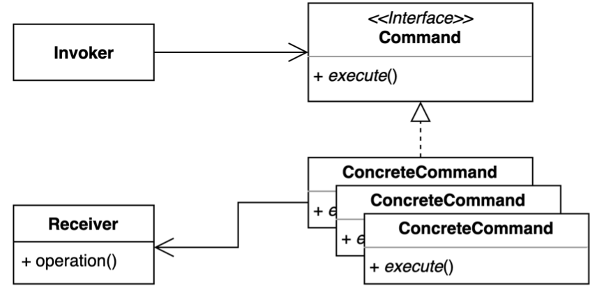

# Command Pattern

- 요청을 캡슐화 하여 호출자(invoker)와 수신자(receiver)를 분리하는 패턴.
- 요청을 처리하는 방법이 바뀌더라도, 호출자의 코드는 변경되지 않는다.



- Invoker(호출자)
  - 기능의 실행을 요청하는 호출자 클래스
- Command
  - 실행될 기능에 대한 인터페이스
- ConcreteCommand
  - 실제 실행될 기능 구현
- Receiver(수신자)
  - ConcreteCommand 에서 execute 메서드를 구현할 때 필요한 클래스
  - ConcreteCommand 의 기능을 실행하기 위해 사용하는 수신자 클래스

> 객체나 클래스 사이의 알고리즘이나 책임 분배에 관련된 패턴이다. <br/>
> 한 객체가 혼자 수행할 수 없는 작업을 여러 개의 객체로 어떻게 분배하는지, 또 그렇게 하면서도 객체 사이의 결합도를 최소화하는 것에 중점을 둔다.

## 구현 방식

```java
// Client
public class Application {

    public static void main(String[] args) {
        Button button = new Button();

        button.press(new GameStartCommand(new Game()));
        button.press(new LightOnCommand(new Light()));
        button.undo();
        button.undo();
    }
}
```

```java
// Invoker
public class Button {

  private final Stack<Command> commands = new Stack<>();

  public void press(Command command) {
    command.execute();
    commands.push(command);
  }

  public void undo() {
    if (!commands.empty()) {
      Command command = commands.pop();
      command.undo();
    }
  }
}
```

```java
// Command
public interface Command {

  void execute();

  void undo();
}
```

```java
// Concrete Command 1
@RequiredArgsConstructor
public class GameStartCommand implements Command {

  private final Game game;

  @Override
  public void execute() {
    game.start();
  }

  @Override
  public void undo() {
    new GameEndCommand(game).execute();
  }
}

// Concrete Command 2
@RequiredArgsConstructor
public class LightOnCommand implements Command {

  private final Light light;

  @Override
  public void execute() {
    light.on();
  }

  @Override
  public void undo() {
    new LightOffCommand(light).execute();
  }
}
```

```java
// Receiver 1
public class Light {

  public void on() {
    System.out.println("불을 켭니다.");
  }

  public void off() {
    System.out.println("불을 끕니다.");
  }
}

// Receiver 2
public class Game {

  public void start() {
    System.out.println("게임을 시작합니다");
  }

  public void end() {
    System.out.println("게임을 종료합니다.");
  }
}
```

## 장단점

### 장점

- 기존 코드를 변경하지 않고 새로운 커맨드를 만들 수 있다.
- 수신자의 코드가 변경되어도 호출자의 코드는 변경되지 않는다.
- 커맨드 객체를 로깅, DB에 저장, 네트워크로 전송 하는 등 다양한 방법으로 활용할 수도 있다.

### 단점

- 코드가 복잡하고 클래스가 많아진다.

## 실무에서 어떻게 쓰이나

- Java
  - Runnable
  - Lambda
  - Method Reference
- Spring
  - SimpleJdbcInsert
  - SimpleJdbcCall
