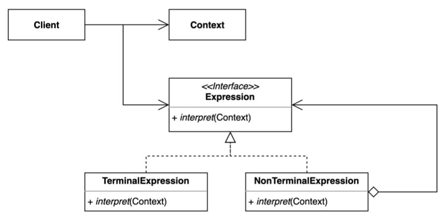

# Interpreter Pattern

인터프리터 패턴은 자주 등장하는 문제를 간단한 언어로 정의하고 재사용하는 패턴이다.

- 일종의 공식(패턴, 언어, 문법)을 정의를하고 대입해서 문제를 풀 경우 사용하는 패턴이다.
- 반복되는 문제 패턴을 언어 또는 문법으로 정의하고 확장할 수 있다.
- 요청을 캡슐화 하여 호출자(invoker)와 수신자(receiver)를 분리하는 패턴.



- Client
  - 언어로 정의한 특정 문장을 나타내는 추상 구문 트리
  - Interpreter() 호출
- Context
  - 글로벌한 정보
  - 인터프리터에 보내는 정보
- Expression(RegularExpression)
  - 문법을 표현
  - Abstract Syntax Tree(AST) 의 모든 노드에서 사용할 Interpret 작업을 정의
- Terminal Expression(LiteralExpression)
  - 그 자체로 종료가 되는 Expression
  - 문법에 정의한 터미널 기호와 관련된 해석 방법을 구현
- NoNTerminal Expression(AlternationExpression, RepetitionExpression, SequenceExpressions)
  - 재귀적으로 다른 Expression 을 참조하고 있는 Expression

> Expression 트리 구성은 Composite 패턴과 굉장히 유사하다.

## 구현 방식

```java
// Client
public class Application {

	public static void main(String[] args) {
		Context context = Context.create()
		  .put('x', 1)
		  .put('y', 2)
		  .put('z', 3);

		PostfixExpression expression = PostfixParser.parse("xyz+-");
		int result = expression.interpret(context);
		System.out.println(result);
	}
}
```

```java
// Context
@NoArgsConstructor(access = AccessLevel.PRIVATE)
public class Context {

  private final Map<Character, Integer> value = new HashMap<>();

  public static Context create() {
    return new Context();
  }

  public Context put(Character k, Integer v) {
    value.put(k, v);
    return this;
  }

  public Integer getValue(Character key) {
    return value.get(key);
  }
}
```

```java
// Expression
@FunctionalInterface
public interface PostfixExpression {

	int interpret(Context context);
}
```

```java
// Terminal Expression
@RequiredArgsConstructor
public class VariableExpression implements PostfixExpression {

	private final Character variable;

	@Override
	public int interpret(Context context) {
		return context.getValue(variable);
	}
}

// NonTerminal Expression 1
@RequiredArgsConstructor
public class PlusExpression implements PostfixExpression {

	private final PostfixExpression left, right;

	@Override
	public int interpret(Context context) {
		return left.interpret(context) + right.interpret(context);
	}
}

// NonTerminal Expression 2
@RequiredArgsConstructor
public class MinusExpression implements PostfixExpression {

  private final PostfixExpression left, right;

  @Override
  public int interpret(Context context) {
    return left.interpret(context) - right.interpret(context);
  }
}

```

```java
// Parser
@NoArgsConstructor(access = AccessLevel.PRIVATE)
public final class PostfixParser {

	public static PostfixExpression parse(String expression) {
		Stack<PostfixExpression> stack = new Stack<>();
		for (char c : expression.toCharArray()) {
			stack.push(getExpression(c, stack));
		}

		return stack.pop();
	}

	private static PostfixExpression getExpression(char c, Stack<PostfixExpression> stack) {
		switch (c) {
			case '+':
				return new PlusExpression(stack.pop(), stack.pop());
			case '-':
				PostfixExpression right = stack.pop();
				PostfixExpression left = stack.pop();
				return new MinusExpression(left, right);
			default:
				return new VariableExpression(c);
		}
	}
}
```

## 장단점

### 장점

- 자주 등장하는 문제 패턴을 언어와 문법으로 정의할 수 있다.
- 기존 코드를 변경하지 않고 새로운 `Expression`을 추가할 수 있다.

### 단점

- 복잡한 문법을 표현하려면 `Expression`과 `Parser`가 복잡해진다.

## 실무에서 어떻게 쓰이나

- Java
  - 자바 컴파일러
  - 정규 표현식
- Spring
  - SpEL (스프링 Expression Language)