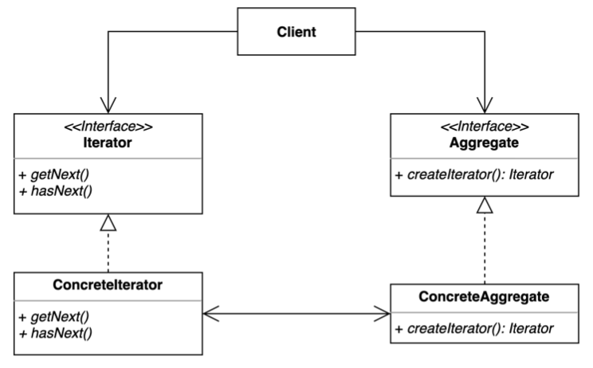

# Iterator Pattern

- 이터레이터 (Interator) 패턴은 집합 객체 내부 구조를 노출시키지 않고 순회 하는 방법을 제공하는 패턴이다.
- 집합 객체를 순회하는 클라이언트 코드를 변경하지 않고 다양한 순회 방법을 제공할 수 있다.



- Iterator
    - 컬렉션의 요소들을 순서대로 검색하기 위한 인터페이스
    - 다음 요소 가져오기, 현재 위치 검색, 반복 다시 시작 등 행위 선언한다.
- ConcreteIterator
    - iterator 인터페이스 구현체
    - 컬렉션 순회를 위한 특정 알고리즘 구현
    - 여러 `iterator`가 서로 독립적으로 동일한 컬렉션을 순회할 수 있다.
- Aggregate(IterableCollection)
    - 여러 요소들로 구성된 컬렉션 인터페이스
    - iterator 를 얻기 위한 하나 이상의 메서드를 선언한다.
- ConcreteAggregate(ConcreteCollection)
    - Aggregate 인터페이스 구현체

## 이슈

- 순회하는 방법, 책임을 분리해야 한다. SRP
- 내부의 구조를 변경할 가능성이 있다.
- 다양한 순회 방법을 제공해야 한다.

## 구현 방식

```java
// Client
public class Application {

	public static void main(String[] args) {
		// Aggregate
		SocialNetwork socialNetwork = new Facebook(Arrays.asList(
		  new Profile("gmoon"),
		  new Profile("back"),
		  new Profile("kim"),
		  new Profile("lee"),
		  new Profile("ahea")
		));

		// iterator
		ProfileIterator iterator = socialNetwork.createProfileIterator();
		while (iterator.hasNext()) {
			Profile profile = iterator.getNext();
			System.out.println("profile name: " + profile.getName());
		}
	}
}
```

```java
// Iterator
public interface ProfileIterator extends Iterator<Profile> {

	Profile getNext();

	boolean hasNext();

	@Override
	default Profile next() {
		return getNext();
	}
}

// Concrete iterator
public class FacebookProfileIterator implements ProfileIterator {

	private Iterator<Profile> internalIterator;

	public FacebookProfileIterator(List<Profile> profiles) {
		sortDescendingByName(profiles);
		this.internalIterator = profiles.iterator();
	}

	private static void sortDescendingByName(List<Profile> profiles) {
		Collections.sort(profiles, (p1, p2) -> p2.getName().compareTo(p1.getName()));
	}

	@Override
	public Profile getNext() {
		return internalIterator.next();
	}

	@Override
	public boolean hasNext() {
		return internalIterator.hasNext();
	}
}
```

```java
// Aggregate (IterableCollection)
public interface SocialNetwork {

	ProfileIterator createProfileIterator();
}

// ConcreteAggregate (ConcreteCollection)
public class Facebook implements SocialNetwork {

	private final List<Profile> profiles;

	public Facebook(List<Profile> profiles) {
		this.profiles = profiles;
	}

	// createIterator(): Iterator
	@Override
	public ProfileIterator createProfileIterator() {
		return new FacebookProfileIterator(profiles);
	}
}
```

## 장단점

### 장점

- 집합 객체가 가지고 있는 객체들에 손쉽게 접근할 수 있다.
- 일관된 인터페이스를 사용해 여러 형태의 집합 구조를 순회할 수 있다.

### 단점

- 클래스가 늘어나고 복잡도가 증가한다.

## 실무에서 어떻게 쓰이나

- Java
    - java.util.Enumeration
    - java.util.Iterator
    - Java StAX (Streaming API for XML)의 Iterator 기반 API
        - XmlEventReader, XmlEventWriter
- Spring
    - CompositeIterator
