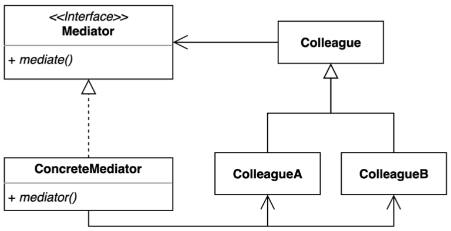
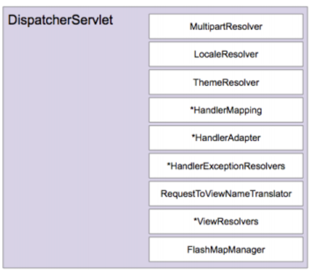

# Mediator Pattern

- 중재자 패턴은 여러 객체들이 소통하는 방법을 캡슐화하는 패턴이다.
    - 의사 소통하는 방법을 추상화시켜서 캡슐화한다.
- 여러 컴포넌트간의 결합도를 중재자를 통해 낮출 수 있다.
- M:N의 관계에서 M:1의 관계로 복잡도를 떨어뜨려 유지 보수 및 재사용, 확장성에 유리한 패턴이다.



- Mediator
    - 중재자 인터페이스
    - Colleague 들과 의존성이 많아질 수 있다.
- ConcreteMediator
    - 중재자 구현체
- Colleague
    - Mediator 를 참조한다.
    - 중재자와 통신하는 인터페이스
- ConcreteColleague
    - Colleague 구현체
    - ConcreteMediator 를 참조한다.

> Colleague 간의 의존성을 줄이기 위한 디자인 패턴

## 이슈

공항 관제 구역에 접근하거나 출발하는 항공기안에 파일럿들은 서로 직접 통신하지 않는다.

대신 활주로 근처 타워안에 있는 항공 관제관과 통신한다.

항공 관제관이 없으면 파일럿들은 공항인근의 모든 비행기안에 있는 파일럿들과 통신해서 착륙 우선순위를 정해야 한다.

## 구현 방식

```java
// Client
public class Application {

	public static void main(String[] args) {
		// Mediator
		ControlTower controlTower = new AirportControlTower();

		// Colleagues
		Pilot pilot1 = new KoreaAirplane(controlTower, "대한항공");
		Pilot pilot2 = new AsianaAirplane(controlTower, "아시아나항공");

		ExecutorService executorService = Executors.newFixedThreadPool(4);
		executorService.submit(pilot1::takeOff);
		executorService.submit(pilot2::takeOff);
		executorService.shutdown();
	}
}
```

```java
// Mediator
public interface ControlTower {

	ControlTowerCommand notifyTakeOff(Pilot pilot, String message);
}

// Concrete Mediator
@RequiredArgsConstructor
public class AirportControlTower implements ControlTower {

	private final Queue<Pilot> waitingLine = new LinkedList<>();

	@Override
	public void notifyTakeOff(Pilot pilot, String message) {
		System.out.format("%s: %s\n", pilot.getName(), message);
		addWaitingLine(pilot);

		takeOff(pilot);
	}

	private void takeOff(Pilot pilot) {
		Pilot waitedPilot = waitingLine.peek();
		String pilotName = pilot.getName();

		// Colleague 행위 처리
		boolean doFlying = waitedPilot.equals(pilot);
		if (doFlying) {
			waitingLine.remove(pilot);
			sendMessageForPilot(pilot, "진행하세요.");
			sendMessageForWaitingPilots(String.format("%s 님이 진행중에 있습니다.", pilotName));
		} else {
			sendMessageForPilot(pilot, "대기해주세요.");
		}

	}

	private void sendMessageForWaitingPilots(String message) {
		for (Pilot p : waitingLine) {
			sendMessageForPilot(p, message);
		}
	}

	private void sendMessageForPilot(Pilot pilot, String message) {
		pilot.notifyFromControlTower(String.format("공항: %s", message));
	}

	private void addWaitingLine(Pilot pilot) {
		waitingLine.add(pilot);
	}
}
```

```java
// Colleague
@Getter
@RequiredArgsConstructor
@EqualsAndHashCode(onlyExplicitlyIncluded = true)
public abstract class Pilot {

	protected final ControlTower controlTower;

	@EqualsAndHashCode.Include
	protected final String name;

	public void notifyFromControlTower(String message) {
		System.out.println(message);
	}

	public void takeOff() {
		controlTower.notifyTakeOff(this, "이륙 합니다.");
	}
}

// ConcreteColleague 1
public class KoreaAirplane extends Pilot {

	public KoreaAirplane(String name) {
		this(new AirportControlTower(), name);
	}

	public KoreaAirplane(ControlTower controlTower, String name) {
		super(controlTower, name);
	}
}

// Concrete Colleague 2
public class AsianaAirplane extends Pilot {

	public AsianaAirplane(String name) {
		this(new AirportControlTower(), name);
	}

	public AsianaAirplane(ControlTower controlTower, String name) {
		super(controlTower, name);
	}
}
```

## 장단점

### 장점

- 컴포넌트 코드를 변경하지 않고 새로운 중재자를 만들어 사용할 수 있다.
- 각각의 컴포넌트 코드를 보다 간결하게 유지할 수 있다.

### 단점

- 중재자 역할을 하는 클래스의 복잡도와 결합도가 증가한다.

## 실무에서 어떻게 쓰이나

- Java
    - ExecutorService
    - Executor
- Spring
    - DispatcherServlet

