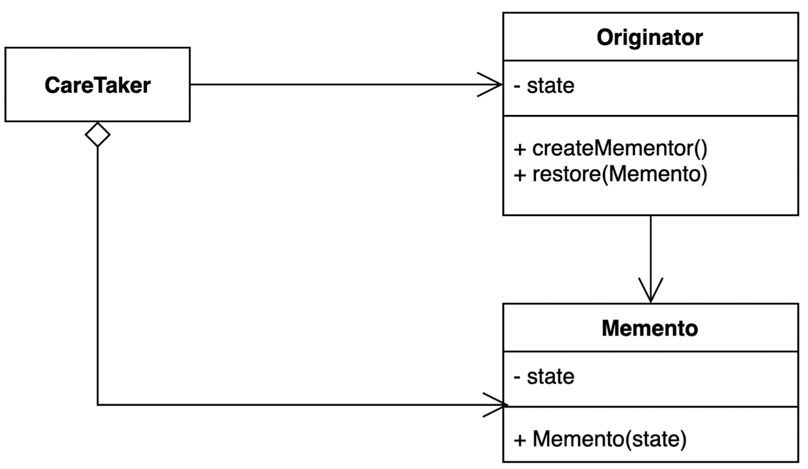

# Memento Pattern

- 캡슐화를 유지하면서 객체 내부 상태를 외부에 저장하는 방법.
- 객체 상태를 외부에 저장했다가 해당 상태로 다시 복구할 수 있다.



- CareTaker
    - Originator 의 상태를 저장 또는 복원한다.
- Originator
    - 상태의 스냅샷을 생성하고, 스냅샷된 상태를 복원할 수 있다.
- Memento
    - Originator 상태의 스냅샷 역할을 하는 객체
    - 데이터를 변조할 수 없도록, Immutable 상태로 구성한다.

## 이슈

- 캡슐화된 상태로 데이터를 저장해야 한다.
- 불변 객체로 데이터가 변조될 가능성을 막아야 한다.

## 구현 방식

```java
// Client
public class Application {

  public static void main(String[] args) {
    // Caretaker
    GamePlayerStage stage = new GamePlayerStage();

    int initScore = 80;
    int initLevel = 10;
    Game game = new Game();
    game.setScore(initScore);
    game.setLevel(initLevel);

    // captured memento
    stage.save(game);

    // modified state
    game.setScore(100);
    game.setLevel(50);

    // restored
    Game loadedGame = stage.restore();
    assert loadedGame.getScore() == initScore;
    assert loadedGame.getLevel() == initLevel;
  }
}
```

```java
// Caretaker
public final class GamePlayerStage {

  private final Stack<GameSave> stages = new Stack<>();

  public void save(Game game) {
    GameSave gameSave = game.save();
    stages.push(gameSave);
  }

  public Game restore() {
    if (stages.isEmpty()) {
      throw new RuntimeException("저장된 스테이지가 존재하지 않습니다.");
    }

    GameSave gameSave = stages.pop();
    return Game.load(gameSave);
  }
}
```

```java
// Originator
@Getter
@Setter
public class Game {

  private int score;
  private int level;

  public static Game load(GameSave gameSave) {
    Game game = new Game();
    game.score = gameSave.getScore();
    game.level = gameSave.getLevel();
    return game;
  }

  GameSave save() {
    return new GameSave(score, level);
  }
}
```

```java
// Memento
@RequiredArgsConstructor
@Getter
public final class GameSave {

  private final int score;
  private final int level;
}
```

## 장단점

### 장점

- 캡슐화를 지키면서 상태 객체 상태 스냅샷을 만들 수 있다.
- 객체 상태 저장하고 또는 복원하는 역할을 CareTaker에게 위임할 수 있다.
- 객체 상태가 바뀌어도 클라이언트 코드는 변경되지 않는다.

### 단점

- 많은 정보를 저장하는 Mementor를 자주 생성하는 경우 메모리 사용량에 많은 영향을 줄 수 있 다.

## 실무에서 어떻게 쓰이나

- Java
    - 객체 직렬화, java.io.Serializable
    - java.util.Date
