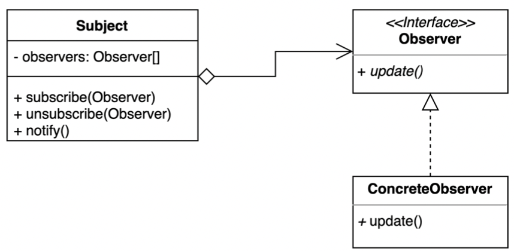

# Observer Pattern

- 옵저버 패턴은 다수의 객체가 특정 객체 상태 변화를 감지하고 알림을 받는 패턴이다.
- 발행(publish)-구독(subscribe) 패턴을 구현할 수 있다.



- Subject (Publisher)
  - 구독중인 여러 Observer 가 존재한다. 
  - Observer 에게 이밴트를 발행한다.
    - 등록된 Observer 를 순회하면서 Observer 가 제공하는 메서드 호출한다.
- Observer (Subscriber)
  - 구독자 역할하는 인터페이스
- ConcreteObserver
  - Observer 구현체
  - Publisher 가 발행한 이벤트에 대한 실제적인 수행 작업 진행

## 이슈

- 가게의 새 제품을 출시할 때 마다 모든 고객에게 메일을 보내야 한다면?
- 고객들이 가게로 부터 새로운 제품이 있는지 주기적으로 가져온다.
  - 새 제품에 관심이 없는 고객들은?
  - 새 제품이 출시할 때 마다 구독한 고객에게만 알려줘야 된다면?
  - 성능 측면에서 polling 방식이 맞는가?  

## 구현 방식

```java
// Client
public class Application {

  public static void main(String[] args) {
    ChatServer chatServer = new ChatServer();
    User user1 = new User("gmoon");
    User user2 = new User("moons");

    String roomOfNewYork = "NewYork";
    String roomOfSeoul = "Seoul";

    chatServer.register(roomOfNewYork, user1);
    chatServer.register(roomOfNewYork, user2);
    chatServer.register(roomOfSeoul, user2);
    chatServer.register(roomOfSeoul, user1);

    chatServer.unregister(roomOfSeoul, user1);

    chatServer.sendMessage(user1, roomOfNewYork, "Welcome to new york.");
    chatServer.sendMessage(user1, roomOfSeoul, "Welcome to seoul.");
  }
}
```

```java
// Subject (Publisher)
public class ChatServer {

	private final Map<String, List<Subscriber>> subscribers = new HashMap<>();

	public void register(String room, Subscriber subscriber) {
		if (existsRoom(room)) {
			getSubscribers(room).add(subscriber);
		} else {
			List<Subscriber> roomSubscribers = new ArrayList<>();
			roomSubscribers.add(subscriber);
			subscribers.put(room, roomSubscribers);
		}
	}

	public void unregister(String room, Subscriber subscriber) {
		if (existsRoom(room)) {
			getSubscribers(room).remove(subscriber);
		}
	}

	public void sendMessage(User sender, String room, String message) {
		if (existsRoom(room)) {
			String roomMessage = String.format("[room-%s] [%s]: %s",
			  room, sender.getName(), message);

			getSubscribers(room)
			  .forEach(s -> s.handleMessage(roomMessage));
		}
	}

	private List<Subscriber> getSubscribers(String room) {
		return subscribers.get(room);
	}

	private boolean existsRoom(String room) {
		return subscribers.containsKey(room);
	}
}
```

```java
// Observer (Subscriber)
public interface Subscriber {

	void handleMessage(String message);
}
```

```java
// Concrete Observer
@RequiredArgsConstructor
@Getter
public class User implements Subscriber{

	private final String name;

	@Override
	public void handleMessage(String message) {
		System.out.format("[%s]: %s\n", name, message);
	}
}
```

```html
[gmoon]: [room-NewYork] [gmoon]: Welcome to new york.
[moons]: [room-NewYork] [gmoon]: Welcome to new york.
[moons]: [room-Seoul] [gmoon]: Welcome to seoul.
```

## 장단점

### 장점

- 상태를 변경하는 객체(publisher)와 변경을 감지하는 객체(subscriber)의 관계를 느슨하게 유지할 수 있다.
- Subject의 상태 변경을 주기적으로 조회하지 않고 자동으로 감지할 수 있다.
- 런타임에 옵저버를 추가하거나 제거할 수 있다.

### 단점

- 복잡도가 증가한다.
- 다수의 Observer 객체를 등록 이후 해지 않는다면 `memory leak`이 발생할 수도 있다.
  - WeakReference 타입을 사용하는 경우도 있지만 해결책은 아니다.

## 실무에서 어떻게 쓰이나

- Java
  - Observable 과 Observer (자바 9부터 deprecated)
  - Java 9 이후
    - PropertyChangeListener, PropertyChangeEvent
    - Flow API
  - SAX (Simple API for XML) 라이브러리
- Spring
  - ApplicationContext와 ApplicationEvent