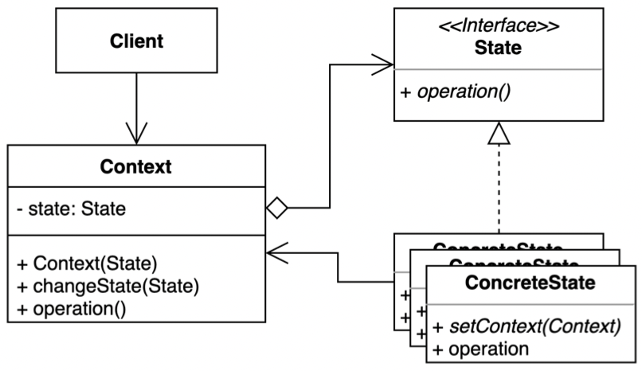

# State Pattern

- 상태 패턴은 객체 내부 상태 변경에 따라 객체의 행동이 달라지는 패턴이다.
- 상태에 특화된 행동들을 분리해 낼 수 있으며, 새로운 행동을 추가하더라도 다른 행동에 영 향을 주지 않는다.



- Client
- Context
  - 모든 상태 변경에 관련된 작업을 관리한다.
  - 상태 변경에 대한 메서드는 State 에게 위임한다.
  - 컨텍스트는 새 상태 개체를 전달하기 위한 setter를 노출합니다.
- State
  - Context 변경될 수 있는 여러 상태에 대한 공통된 인터페이스
  - Context으로 부터 위임될 일반화된 행위를 정의한다.
- ConcreteState
  - 상태에 따라 달라지는 행위를 정의한다.

## 이슈

## 구현 방식

```java
// Context
public class AirPod {

	private State state;

	public AirPod() {
		this.state = new ReadyState();
	}

	public void press() {
		this.state = state.press();
	}

	public void changeState(State state) {
		this.state = state;
	}
}
```

```java
// State
@FunctionalInterface
public interface State {

  State press();
}

// Concrete State 1
public class ReadyState implements State {

	@Override
	public State press() {
		System.out.println("ready.");
		return new PlayState();
	}
}

// Concrete State 2
public class PlayState implements State {

  @Override
  public State press() {
    System.out.println("play music.");
    return new StopState();
  }
}

// Concrete State 2
public class StopState implements State {

  @Override
  public State press() {
    System.out.println("stop music.");
    return new PlayState();
  }
}
```

```java
// Client
public class Application {

	public static void main(String[] args) {
		AirPod player = new AirPod();

		player.press();
		player.press();
		player.press();

		player.changeState(new PlayState());
		player.press();
	}
}
```

```html
ready.
play music.
stop music.
play music.
```

## 장단점

### 장점

- 상태에 따른 동작을 개별 클래스로 옮겨서 관리할 수 있다. 
- 기존의 특정 상태에 따른 동작을 변경하지 않고 새로운 상태에 다른 동작을 추가할 수 있다.
- 코드 복잡도를 줄일 수 있다.

### 단점

- 복잡도가 증가한다.
