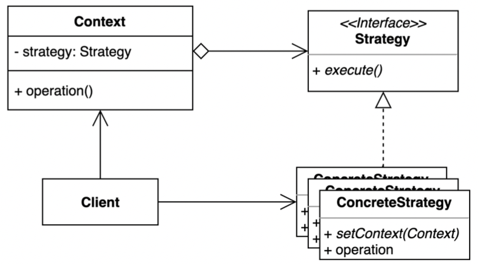

# Strategy Pattern

- 전략 패턴은 여러 알고리듬을 캡슐화하고 상호 교환 가능하게 만드는 패턴이다.
- 컨텍스트에서 사용할 알고리듬을 클라이언트 선택한다.



- Context
  - Strategy 인터페이스를 참조한다.
  - Strategy 인터페이스를 통해서만 통신한다.
  - Strategy 변경 가능해야 함으로, constructor 또는 setter 제공한다. 
- Strategy
  - Context 가 전략을 실행하는 데 사용하는 방법을 선언합니다.
- ConcreteStrategy
  - Context 가 사용하는 알고리즘 구현한다.

## 구현 방식

```java
// Client
public class Application {

	public static void main(String[] args) {
		Car car = new Car();

		MoveRule forwardMoveRule = () -> true;
		car.movable(forwardMoveRule);
		car.movable(new RandomMoveRule()); // 전진할 수도 안할 수도 있다.
	}
}
```

```java
// Context
public class Car {

	public void movable(MoveRule moveRule) {
		if (moveRule.isMovable()) {
			System.out.println("자동차는 전진 한다.");
		}
	}
}
```

```java
// Strategy
public interface MoveRule {

	boolean isMovable();
}

// Concrete Strategy 1
public class RandomMoveRule implements MoveRule {

  private static final Random RANDOM = new Random();

  private static final int MIN_OF_FORWARD_MOVE = 4;
  private static final int MIN_OF_RANDOM_NUMBER = 0;
  private static final int MAX_OF_RANDOM_NUMBER = 9;

  @Override
  public boolean isMovable() {
    return MIN_OF_FORWARD_MOVE <= generateRandomNumber();
  }

  private int generateRandomNumber() {
    return MIN_OF_RANDOM_NUMBER
            + RANDOM.nextInt(MAX_OF_RANDOM_NUMBER - MIN_OF_RANDOM_NUMBER + 1);
  }
}
```

## 장단점

### 장점

- 새로운 전략을 추가하더라도 기존 코드를 변경하지 않는다.
- 상속 대신 위임을 사용할 수 있다.
- 런타임에 전략을 변경할 수 있다.

### 단점

- 복잡도가 증가한다.
- 클라이언트 코드가 구체적인 전략을 알아야 한다.

## 실무에서 어떻게 쓰이나

- Java
    - Comparator
- Spring
    - ApplicationContext
    - PlatformTransactionManager