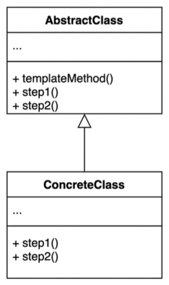
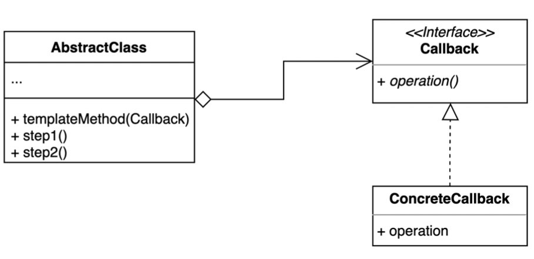

# Template method Pattern

- 템플릿 메소드 패턴은 알고리듬 구조를 서브 클래스가 확장할 수 있도록 템플릿으로 제공하는 방법이다.
- 추상 클래스는 템플릿을 제공하고 하위 클래스는 구체적인 알고리듬을 제공한다.
- 콜백으로 상속 대신 위임을 사용하는 템플릿 패턴.



## 템플릿 콜백 (Template-Callback) 패턴

- 상속 대신 익명 내부 클래스 또는 람다 표현식을 활용할 수 있다.



## 구현 방식

```java
// Client
public class Application {

	public static void main(String[] args) {
		// 1,1,1
		FileProcessor fileProcessor = new Multiply("/number.txt");

		assert fileProcessor.process() == 1;
		assert fileProcessor.process(new Plus()) == 3; // callback
	}
}
```

```java
// AbstractClass
@RequiredArgsConstructor
public abstract class FileProcessor {

  private final String path;

  public int process() {
    return process(null);
  }

  // templateMethod
  public int process(Operator operator) {
    try (
            InputStream inputStream = getClass().getResourceAsStream(path);
            InputStreamReader inputStreamReader = new InputStreamReader(inputStream);
            BufferedReader reader = new BufferedReader(inputStreamReader);
            Stream<String> lines = reader.lines()
    ) {
      return lines
              .mapToInt(Integer::parseInt)
              .reduce((a, b) -> getResult(operator, a, b))
              .orElse(0);
    } catch (Exception e) {
      throw new IllegalArgumentException(path + "에 해당하는 파일이 없습니다.", e);
    }
  }

  private int getResult(Operator operator, int a, int b) {
    boolean existsCallback = operator != null;
    if (existsCallback) {
      return operator.getResult(a, b);
    }
	
    return getResult(a, b);
  }

  // sub class 재정의
  protected abstract int getResult(int result, int number);
}

// ConcreteClass
public class Multiply extends FileProcessor {

  public Multiply(String path) {
    super(path);
  }

  // sub class 재정의
  @Override
  protected int getResult(int number1, int number2) {
    return number1 * number2;
  }
}
```

```java
// Callback
@FunctionalInterface
public interface Operator {

	int getResult(int a, int b);
}

// Concrete Callback
public class Plus implements Operator {

  @Override
  public int getResult(int a, int b) {
    return a + b;
  }
}
```
## 장단점

### 장점

- 템플릿 코드를 재사용하고 중복 코드를 줄일 수 있다.
- 템플릿 코드를 변경하지 않고 상속을 받아서 구체적인 알고리즘만 변경할 수 있다.

### 단점

- 리스코프 치환 원칙을 위반할 수도 있다.
  - sub class 에서 동작을 변경할 수 있기 때문
- 알고리듬 구조가 복잡할 수록 템플릿을 유지하기 어려워진다.

## 실무에서 어떻게 쓰이나

- Java
  - HttpServlet
- Spring
  - 템플릿 메소드 패턴
    - Configuration
  - 템플릿 콜백 패턴
    - JdbcTemplate
    - RestTemplate ...