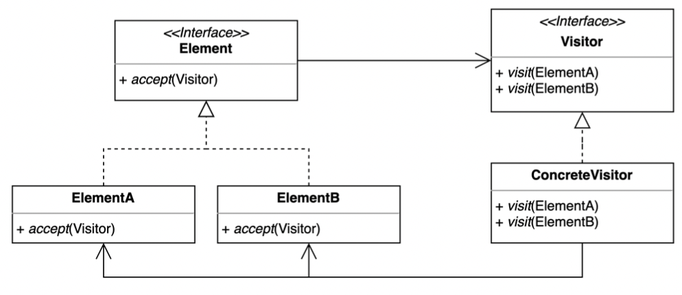

# Visitor Pattern

- 방문자 패턴은 기존 코드를 변경하지 않고 새로운 기능을 추가하는 방법이다.
- 더블 디스패치 (Double Dispatch)를 활용할 수 있다.
- 알고리즘을 객체 구조에서 분리시키는 디자인 패턴이다.
  - 실제 로직을 가지고 있는 객체(Visitor)가 로직을 적용할 객체(Element)를 방문하면서 실행된다.
- Element 가 추가될 가능성이 적고 Visitor 추가가 흔할 경우 유용하다.

> Dispatch 란 다형성이나 분배 또는 배치를 활용하여 요청을 처리할 구체적인 클래스를 위임하는 일련의 과정



- Visitor
  - ConcreteElement 를 인수로 사용할 수 있는 visit 메소드를 정의한다. 
  - Element 개수 만큼 오버로딩 메소드를 가져야한다.
- Concrete Visitor
  - 다른 Concrete Element 클래스에 맞게 오버로딩 visit 메서드를 구현한다.
- Element
  - Dispatch 가 일어난다.
  - 인터페이스 는 방문자를 "accept"하는 메서드를 정의한다.
  - accept 메서드는 Visitor 인터페이스 타입을 반환한다.
    - accept: 디스 패치용 메서드
- Concrete Element
  - accept 메서드를 구현한다. 
  - accept 메서드는 Visitor 에게 visit 메서드로 호출을 위임한다.

## 구현 방식

```java
// Element
public interface Shape {
	
	void accept(Device device);
}

// Concrete Element 1
public class Triangle implements Shape {

  @Override
  public void accept(Device device) {
    device.print(this);
  }
}

// Concrete Element 2
public class Circle implements Shape {

  @Override
  public void accept(Device device) {
    device.print(this);
  }
}
```

```java
// Visitor
public interface Device {

	void print(Triangle triangle);

	void print(Circle circle);
}

// Concrete Visitor 1
public class IPhone implements Device {

  @Override
  public void print(Triangle triangle) {
    System.out.println("Print triangle to IPhone.");
  }

  @Override
  public void print(Circle circle) {
    System.out.println("Print circle to IPhone.");
  }
}

// Concrete Visitor 2
public class IPad implements Device {

  @Override
  public void print(Triangle triangle) {
    System.out.println("Print triangle to IPad.");
  }

  @Override
  public void print(Circle circle) {
    System.out.println("Print circle to IPad.");
  }
}
```

```java
// Client
public class Application {

	public static void main(String[] args) {
		// Double Dispatch 런타임시 두번 Dispatch 가 일어난다.
		// 1. accept: Shape#accept -> Triangle#accept
		// 2. visit : Device#print -> IPhone#print
		Shape triangle = new Triangle();
		Device iPhone = new IPhone();
		triangle.accept(iPhone);

		Shape circle = new Circle();
		Device iPad = new IPad();
		circle.accept(iPad);
	}
}
```

```text
Print triangle to IPhone.
Print circle to IPad.
```

## 장단점

### 장점

- 기존 코드를 변경하지 않고 새로운 코드를 추가할 수 있다.
- 추가 기능을 한 곳에 모아둘 수 있다.

### 단점

- 복잡하다.
- 새로운 Element 를 추가하거나 제거할 때 모든 Visitor 코드를 변경해야 한다.

## 실무에서 어떻게 쓰이나

- Java
  - FileVisitor, SimpleFileVisitor
  - AnnotationValueVisitor
  - ElementVisitor
- Spring
  - BeanDefinitionVisitor